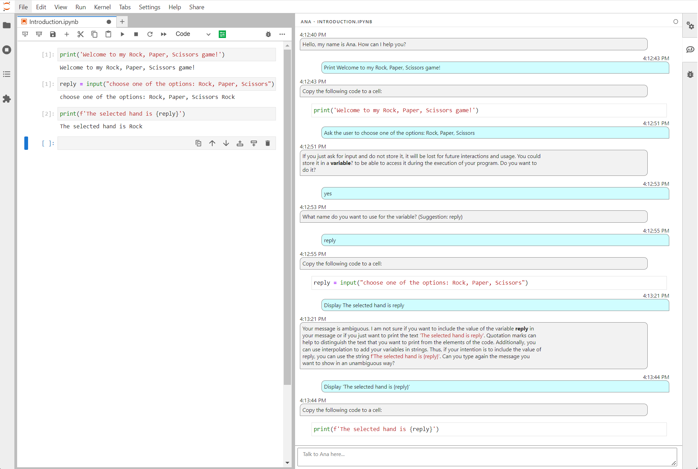

# anachat

[](https://github.com/EPICLab/DSChatbot/actions/workflows/build.yml)[](https://mybinder.org/v2/gh/EPICLab/DSChatbot/main?urlpath=lab)

Configurable Chatbot for support of different tasks in Jupyter Lab.

This branch ([education](https://github.com/EPICLab/DSChatbot/tree/education)) supports teaching computational thinking and programming in Jupyter Lab. If you are interested in the chatbot configured for data science analysis, please check the [main](https://github.com/EPICLab/DSChatbot/tree/main) branch.




This extension is composed of a Python package named `anachat`
for the server extension and a NPM package named `anachat`
for the frontend extension.

## Limitations

Currently, the chatbot only has hardcoded messages that use regex to match user input and a super user mode that is designed to be executed with the Wizard of Woz (see [woz.md](woz.md)). Using regex for a conversational agent is not the best option, since it is too strict to consider nuances in natural language processing. The Wizard of Woz studies will allow us to model end-user expectations and dialog flows to create a better experience that uses large language models.

## Requirements

- JupyterLab >= 3.0

## Install

Currently, it is only possible to install the chatbot in development mode. In this mode, you will need NodeJS to build the extension package. For all the details on the development installation mode, please check [CONTRIBUTING.md](CONTRIBUTING.md).

Run the commands below to install the chatbot:
```bash
# Clone and change into repository
git clone git@github.com:EPICLab/DSChatbot.git
cd DSChatbot
# Change to education branch
git checkout education
# Install package in development mode
pip install -e .
# Link your development version of the extension with JupyterLab
jupyter labextension develop . --overwrite
# Server extension must be manually installed in develop mode
jupyter server extension enable anachat
# Rebuild extension Typescript source after making changes
jlpm run build
```

Now, you can execute Jupyter Lab to use it:
```bash
jupyter lab
```

In the future, we will add the option to install the chatbot from PyPI without requiring NodeJS with the following command:

```bash
pip install anachat
```

## Uninstall

To remove the extension, execute:

```bash
pip uninstall anachat
```

## Troubleshoot

If you are seeing the frontend extension, but it is not working, check
that the server extension is enabled:

```bash
jupyter server extension list
```

If the server extension is installed and enabled, but you are not seeing
the frontend extension, check the frontend extension is installed:

```bash
jupyter labextension list
```

## Development

The root of the Python package is the directory `anachat`. It has 3 main directories:

- [data](anachat/data/) has json files that define [regexes](anachat/data/regexes.json) for hard-coded messages and [subjects](anachat/data/subjects.json) for auto-complete actions. Both files refer to states defined in [code/states](anachat/core/states) 

- [core](anachat/core/) is the module the handles the chatbot processing. It defines multiple handlers on the [handlers](anachat/core/handlers) submodule and multiple states on the [code/states](anachat/core/states) submodule. The main orchestrator file ins [ana.py](anachat/core/ana.py)

- [comm](anachat/comm/) is the module that handles the communication between the frontend extension and the core orchestrator. It uses Jupyter Comm and redirects the messages to proper orchestrator methods.

The root of the frontend extension is the directory `src`. It is divided into three parts. The displayed components use Svelte components stored at the [components](src/components/) directory. The communication with the Python server extension uses the [dataAPI](src/dataAPI/) directory. Finally, the remaining files of the extension manage the execution of the Jupyter extension and provide a bridge among these elements.
